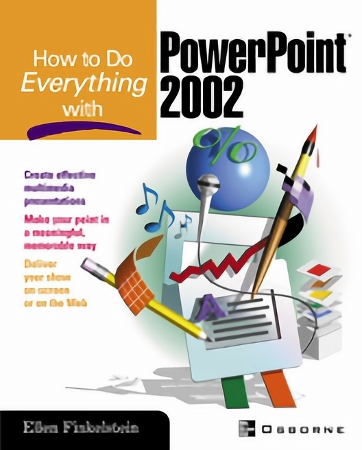

# SRDenseNet

["Image Super-Resolution Using Dense Skip Connections"](http://openaccess.thecvf.com/content_ICCV_2017/papers/Tong_Image_Super-Resolution_Using_ICCV_2017_paper.pdf).

<center></center>

## SRDenseNet Structure Summary 5단계
- 1단계, 처음 Convolution Layer에서 low level features 추출
- 2단계, Dense block에서 Densely Skip Connection 방식을 통해 high level features 추출
- 3단계, Bottleneck layer를 통해 feature 수 절감
- 4단계, Deconvolution layers를 통해 upscaling
- 5단계, Reconstruction layer를 통해 SR image 복원

[더보기](https://velog.io/@danielseo/Computer-Vision-SRDenseNet)

## Requirements

- PyTorch 1.0.0
- Numpy 1.15.4
- Pillow 5.4.1
- h5py 2.8.0
- tqdm 4.30.0

## Train


```bash
python train.py --train-file "BLAH_BLAH/coco2017_x4.h5" \
                --eval-file "BLAH_BLAH/Set5_x4.h5" \
                --outputs-dir "BLAH_BLAH/outputs" \
                --scale 4 \  # Only scale factor 4 can be used.
                --lr 1e-4 \
                --batch-size 16 \
                --num-epochs 60 \
                --num-workers 8 \
                --seed 123                
```

## Test


```bash
python test.py --weights-file "BLAH_BLAH/srdensenet_x4.pth" \
               --image-file "data/ppt3.bmp" \
               --scale 4
```

## Results

PSNR was calculated on the Y channel.

### Set5

| Eval. Mat | Scale | SRDenseNet_All (Paper) | SRDenseNet_All (Ours) |
|-----------|-------|-------|-----------------|
| PSNR | 4 | 32.02 | 31.80 |

<table>
    <tr>
        <td><center>Original</center></td>
        <td><center>BICUBIC x4</center></td>
        <td><center>SRDenseNet x4 (22.94 dB)</center></td>
    </tr>
    <tr>
    	<td>
    		<center></center>
    	</td>
    	<td>
    		<center></center>
    	</td>
    	<td>
    		<center></center>
    	</td>
    </tr>
    <tr>
        <td><center>Original</center></td>
        <td><center>BICUBIC x4</center></td>
        <td><center>SRDenseNet x4 (27.19 dB)</center></td>
    </tr>
    <tr>
    	<td>
    		<center></center>
    	</td>
    	<td>
    		<center></center>
    	</td>
    	<td>
    		<center></center>
    	</td>
    </tr>      
</table>
