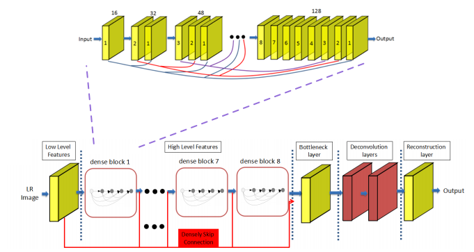

# SRDenseNet

["Image Super-Resolution Using Dense Skip Connections"](http://openaccess.thecvf.com/content_ICCV_2017/papers/Tong_Image_Super-Resolution_Using_ICCV_2017_paper.pdf).

<center></center>

## SRDenseNet Structure Summary 5단계
- 1단계, 처음 Convolution Layer에서 low level features 추출
- 2단계, Dense block에서 Densely Skip Connection 방식을 통해 high level features 추출
- 3단계, Bottleneck layer를 통해 feature 수 절감
- 4단계, Deconvolution layers를 통해 upscaling
- 5단계, Reconstruction layer를 통해 SR image 복원

[더보기](https://velog.io/@danielseo/Computer-Vision-SRDenseNet)


## Train


```bash
python train.py --train-file "./data_file/train_x4.h5" \
                --eval-file "./data_file/eval_x4.h5" \
                --outputs-dir "./outputs" \
                --scale 4 \  # Only scale factor 4 can be used.
                --lr 1e-4 \
                --batch-size 16 \
                --num-epochs 60 \
                --num-workers 8 \
                --seed 123                
```

## Test


```bash
python test.py --weights-file "./outputs/x4/srdensenet_x4.pth" \
               --image-file "./data/ppt3.bmp" \
               --scale 4
```

## Results


