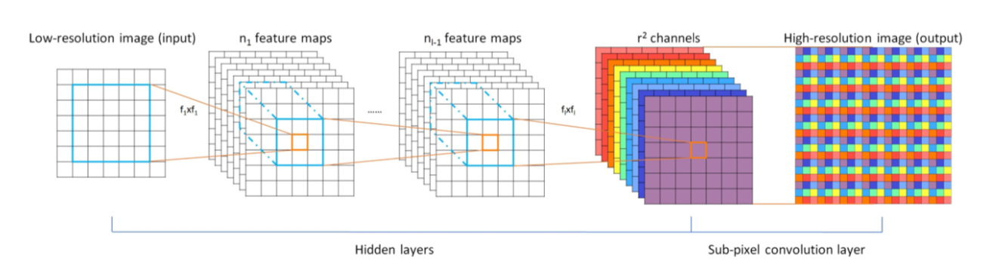

# ESPCN & light-ESPCN

["Real-Time Single Image and Video Super-Resolution Using an Efficient Sub-Pixel Convolutional Neural Network"](https://arxiv.org/abs/1609.05158).

<center></center>

ESPCN은 FSRCNN 모델과 같이 기존의 LR(Low-Resolution)이미지에서 feature extraction을 한 후 마지막 layer에서 HR(High-Resolution)으로 upscaling 시키는 방식의 모델이며, FSRCNN이 ConvTranspose2d를 이용하여 upscale을 한 반면, ESPCN은 PixelShuffle을 이용하여 upscale을 하였음.

### [Abstract]
ESPCN의 큰 특징 2가지
- 첫째, 3개의 convolution layer를 사용함. 
- 둘째, LR 이미지를 그대로 convolution layer에 넣고 마지막 단계에서 sub-pixel convolution layer를 이용하여 upscailing 함. 

이렇게 함으로써 LR 공간에서 feature들의 특징을 뽑아내게 되고, 이는 filter size를 줄여 최종적으로 모델의 복잡성이 낮아지게 됨.
    parser.add_argument('--images-dir', type=str, required=True)
    parser.add_argument('--output-path', type=str, required=True)
    parser.add_argument('--scale', type=int, default=3)

## Prepare.py

prepare.py를 이용하여 91-image(train), Set5(eval) dataset을 HDF5 file로 바꿔준 뒤에 train.py 실행하였으며,
.h5 파일 경로는 본인 환경에 맞게 설정하면 됨.

train_x3.h5

```bash
python prepare.py --images-dir "./datasets/train" \
                --output-path "output_path/train_x3.h5" \
                --scale 3
```

eval_x3.h5

```bash
python prepare.py --images-dir "./datasets/eval" \
                --output-path "./output_path/eval_x3.h5" \
                --scale 3 \
                --eval
```

## Train


```bash
python train.py --train-file "./output_path/train_x3.h5" \
                --eval-file "./output_path/eval_x3.h5" \
                --outputs-dir "./output_dir" \
                --scale 3               
```

## Test

source 제공자의 pre-trained model을 다운로드 받고 싶으신 분들은 참고!

| Model | Scale | Link |
|-------|-------|------|
| ESPCN (91) | 3 | [Download](https://www.dropbox.com/s/2fl5jz5nw9oiw1f/espcn_x3.pth?dl=0) |


```bash
python test.py --weights-file "./output_dir/x3/best.pth" \
               --image-file "./data/butterfly_GT.bmp" \
               --scale 3
```

## Results

### Set5

| Eval. Mat | Scale | Paper (91) | ESPCN (91) | light-ESPCN (91) |
|-----------|-------|-------|-----------------|-----------------|
| PSNR | 3 | 32.55 | 32.88 | 32.19 |

<table>
    <tr>
        <td><center>Original</center></td>
        <td><center>BICUBIC x3</center></td>
        <td><center>ESPCN x3 (23.84 dB)</center></td>
        <td><center>light-ESPCN x3 (23.82 dB)</center></td>
    </tr>
    <tr>
    	<td>
    		<center></center>
    	</td>
    	<td>
    		<center></center>
    	</td>
    	<td>
    		<center></center>
    	</td>
      <td>
    		<center></center>
    	</td>
    </tr>
    <tr>
        <td><center>Original</center></td>
        <td><center>BICUBIC x3</center></td>
        <td><center>ESPCN x3 (25.32 dB)</center></td>
        <td><center>light-ESPCN x3 (25.36 dB)</center></td>  
    </tr>
    <tr>
    	<td>
    		<center></center>
    	</td>
    	<td>
    		<center></center>
    	</td>
    	<td>
    		<center></center>
    	</td>
      <td>
    		<center></center>
    	</td>
    </tr>  
</table>

--------
### source
https://github.com/yjn870/ESPCN-pytorch
